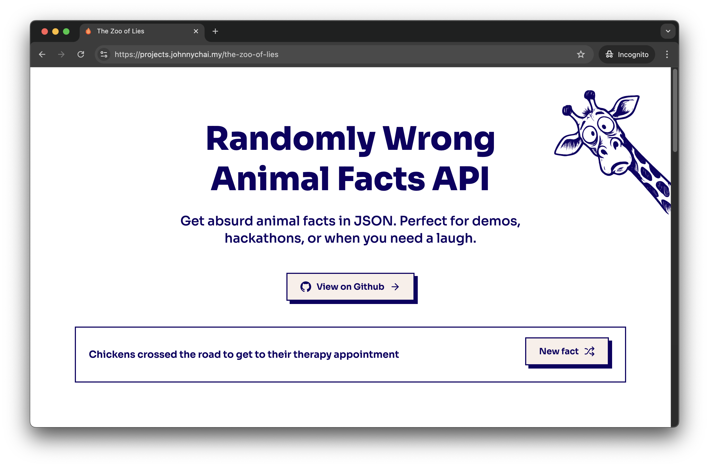

# The Zoo of Lies 🦒

A fun experiment with **Honox** (Hono + React), **Cloudflare Workers**, and **KV storage** to serve random animal facts (or lies, who knows?).

## What is this?

This project is a playground for testing out modern web technologies:

- **Honox**: A full-stack framework combining Hono (web framework) with React
- **Cloudflare Workers**: Edge computing platform for fast, global deployment
- **Cloudflare KV**: Key-value storage for the facts database
- **Rate Limiting**: Built-in protection against abuse

The app serves random "facts" about animals (some might be lies, hence the name) through a simple API and displays them in a clean React interface.

## Features

- 🚀 **Edge-first**: Deployed on Cloudflare Workers for global performance
- 🗄️ **KV Storage**: Facts stored in Cloudflare KV for fast retrieval
- 🛡️ **Rate Limited**: 10 requests per minute per IP (production only)
- 📱 **Responsive**: Clean UI built with Tailwind CSS
- ⚡ **Fast**: Sub-100ms response times at the edge

## API Endpoints

### Get Random Facts

```bash
# Get 1 random fact
GET https://projects.johnnychai.my/the-zoo-of-lies/api

# Get multiple random facts (1-10)
GET https://projects.johnnychai.my/the-zoo-of-lies/api?count=3
```

### Get Specific Fact

```bash
# Get fact by ID
GET https://projects.johnnychai.my/the-zoo-of-lies/api/2
```

### Response Format

```json
{
  "facts": [
    {
      "id": "30",
      "fact": "Hummingbirds are actually tiny helicopters operated by even tinier pilots"
    }
  ],
  "count": 1
}
```

## Development

### Prerequisites

- Node.js 18+
- npm or yarn
- Cloudflare account (for deployment)

### Local Development

1. **Install dependencies**

   ```bash
   npm install
   ```

2. **Start development server**

   ```bash
   npm run dev
   open http://localhost:5173/the-zoo-of-lies
   ```

   This starts the Vite dev server with Hono integration.

3. **Preview with Wrangler**
   ```bash
   npm run preview
   open http://localhost:8787/the-zoo-of-lies
   ```
   This runs the app using Wrangler's local development environment.

### Project Structure

```
the-zoo-of-lies/
├── app/
│   ├── components/          # React components
│   ├── islands/            # Honox islands (interactive components)
│   ├── routes/             # Route handlers
│   │   └── the-zoo-of-lies/
│   │       ├── index.tsx   # Main page
│   │       └── api/        # API endpoints
│   └── styles/             # Global styles
├── public/                 # Static assets
├── wrangler.jsonc         # Cloudflare Workers config
└── vite.config.ts         # Vite configuration
```

## Deployment

### 1. Setup Cloudflare KV

First, create a KV namespace in your Cloudflare dashboard:

```bash
# Create KV namespace
wrangler kv:namespace create "FACTS"

# Create preview namespace for development
wrangler kv:namespace create "FACTS" --preview
```

Update the `kv_namespaces` section in `wrangler.jsonc` with your namespace IDs.

### 2. Add Facts to KV

You'll need to populate your KV store with facts. You can do this through the Cloudflare dashboard or programmatically:

```bash
# Add a fact
wrangler kv:key put "1" "Giraffes have the same number of neck vertebrae as humans" --binding FACTS

# Add more facts
wrangler kv:key put "2" "Penguins can jump as high as 6 feet in the air" --binding FACTS
```

### 3. Configure Rate Limiting

The app uses Cloudflare's rate limiter. Update the `unsafe.bindings` section in `wrangler.jsonc` with your rate limiter namespace ID.

### 4. Deploy

```bash
# Build and deploy to production
npm run deploy

# Or deploy to a specific environment
wrangler deploy --env prod
```

### 5. Custom Domain (Optional)

Update the `routes` section in `wrangler.jsonc` to use your own domain:
I had mine set as `projects.johnnychai.my` because I need to had it under a subdomain, but you can use any domain you own.

```json
{
  "routes": [
    {
      "pattern": "yourdomain.com/*",
      "zone_name": "yourdomain.com"
    }
  ]
}
```

## Environment Variables

The app uses these environment variables (configured in `wrangler.jsonc`):

- `API_URL`: The base URL for API endpoints
- `FACTS`: KV namespace binding for facts storage
- `RATE_LIMITER`: Rate limiter binding (production only)

## Technologies Used

- **[Hono](https://hono.dev/)**: Fast, lightweight web framework
- **[Cloudflare Workers](https://workers.cloudflare.com/)**: Edge computing platform
- **[Cloudflare KV](https://developers.cloudflare.com/kv/)**: Global key-value storage
- **[Tailwind CSS](https://tailwindcss.com/)**: Utility-first CSS framework
- **[Vite](https://vitejs.dev/)**: Build tool and dev server

## Motivation

> "This project is hosted on Cloudflare Workers, with KV as the database, because why not make nonsense fast at the edge? Actually, this is just me testing out Hono with React and Cloudflare Workers, playing with their 'cool edge whatever that is.' If you get a laugh (or at least a raised eyebrow), mission accomplished."

## License

MIT License - feel free to use this as a starting point for your own experiments!

---

**Live Demo**: [https://projects.johnnychai.my/the-zoo-of-lies](https://projects.johnnychai.my/the-zoo-of-lies)
